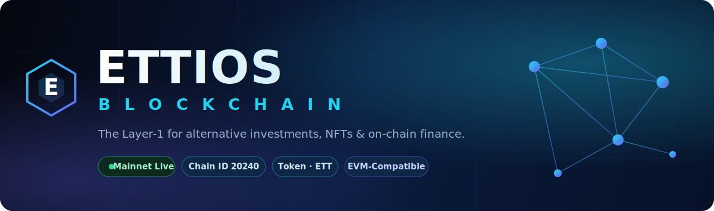

<div align="center">



<br/><br/>

# 🌐 Ettios Blockchain

### The Layer-1 for alternative investments, NFTs &amp; on-chain finance.

<p>
<a href="https://www.ettiosblockchain.io/"></a>
<a href="https://scan.ettiosblockchain.io/"></a>
<a href="https://wallet.ettiosblockchain.io/"></a>
</p>

<p>


</p>

</div>

---

## ⚡ Quick Access

<table width="100%">
<tr align="center">
<td width="33%">

### 🔎 Explorer
**Ettios Scan**<br/>
Blocks · txs · tokens · contracts<br/>
[**scan.ettiosblockchain.io →**](https://scan.ettiosblockchain.io/)

</td>
<td width="33%">

### 👛 Wallet
**Ettios Wallet**<br/>
Send · receive · manage assets<br/>
[**wallet.ettiosblockchain.io →**](https://wallet.ettiosblockchain.io/)

</td>
<td width="33%">

### 🌍 Website
**Ettios Blockchain**<br/>
Ecosystem · products · docs<br/>
[**ettiosblockchain.io →**](https://www.ettiosblockchain.io/)

</td>
</tr>
</table>

---

## 🚀 What is Ettios?

**Ettios** is an **EVM-compatible Layer-1 blockchain** built for the next wave of digital finance — powering **alternative investments**, **NFTs**, and **on-chain applications** with low fees, fast finality, and full Ethereum tooling compatibility.

> If you can build it on Ethereum, you can build it on Ettios. Point your wallet, contracts, and tooling at the Ettios network and ship.

---

## ⚙️ Network Details

| Parameter | Value |
| :--- | :--- |
| **Network Name** | Ettios Mainnet |
| **Chain ID** | `20240` |
| **Currency Symbol** | `ETT` |
| **RPC URL** | `https://rpc.ettiosblockchain.io/` |
| **Block Explorer** | https://scan.ettiosblockchain.io/ |
| **Wallet** | https://wallet.ettiosblockchain.io/ |
| **Virtual Machine** | EVM-Compatible |

> **Add Ettios to MetaMask:** open your wallet → *Add Network* → *Add manually* → paste the values above.

---

## 🧩 Ecosystem

| | Product | Description |
| :---: | :--- | :--- |
| 🔎 | **[Ettios Scan](https://scan.ettiosblockchain.io/)** | Explore blocks, transactions, tokens, contracts &amp; network health |
| 👛 | **[Ettios Wallet](https://wallet.ettiosblockchain.io/)** | Hold, send and receive ETT and on-chain assets |
| 💎 | **ETT Token** | The native gas &amp; utility asset of the network |
| 🌍 | **[Ettios Platform](https://www.ettiosblockchain.io/)** | Alternative investment products, built on-chain |

---

## 🛠️ Build on Ettios

```js
// Connect with ethers.js
import { ethers } from "ethers";

const provider = new ethers.JsonRpcProvider("https://rpc.ettiosblockchain.io/");
const network  = await provider.getNetwork();
console.log("Connected to Ettios — chainId:", network.chainId); // 20240n
```

```js
// Add the network programmatically (EIP-3085)
await window.ethereum.request({
  method: "wallet_addEthereumChain",
  params: [{
    chainId: "0x4F10", // 20240
    chainName: "Ettios Mainnet",
    nativeCurrency: { name: "Ettios", symbol: "ETT", decimals: 18 },
    rpcUrls: ["https://rpc.ettiosblockchain.io/"],
    blockExplorerUrls: ["https://scan.ettiosblockchain.io/"],
  }],
});
```

---

## 🔗 Community &amp; Links

<div align="center">

<a href="https://www.ettiosblockchain.io/"></a>
<a href="https://scan.ettiosblockchain.io/"></a>
<a href="https://wallet.ettiosblockchain.io/"></a>
<a href="https://www.facebook.com/www.ettios.io/"></a>
<a href="https://www.instagram.com/ettios.io/"></a>

</div>

<br/>

<div align="center">

**© 2026 Ettios Technologies** · Built on open standards, powered by the community.

</div>
